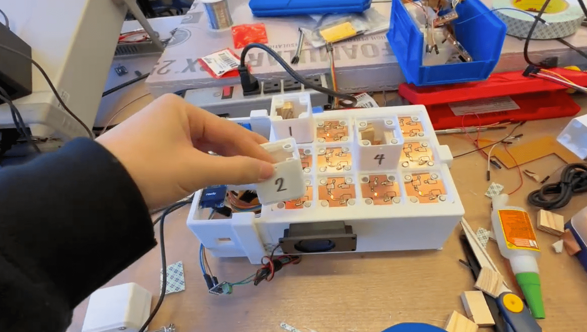

# music machine 

project for how to make anything 

Code for attiny1614 microcontrollers (in the blocks) are in `controller_1614_ino` folder. 

Code for rp2040 microcontrollers (in the boxes) are in `row1_rp2040`, `row2_rp2040`, `row3_rp2040` folders. Audio files are .h files from orangefreesounds wav files converted to header files & compressed. 